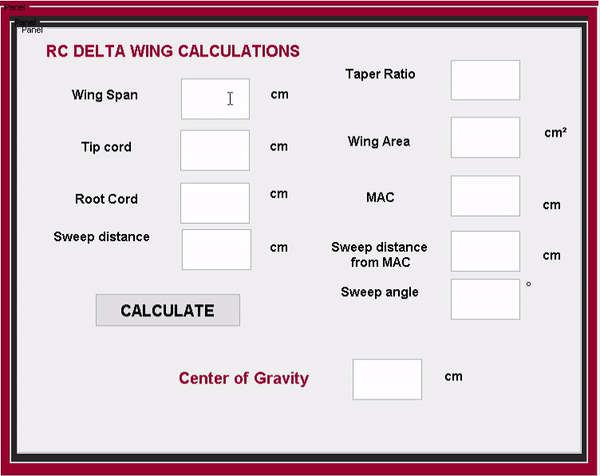

# RC PLANE CALCULATOR USING MATLAB 

RC plane calculator using matlab GUIDE

## Getting Started

By using the wing span we can calculate various parameters like fuselage length, wing area, wing cord, wing thicknes, surface area of horizontal and vertical sabilizer, center of gravity for trainer and delta wing aircraft

### Instalation

* Download and Install Matlab - [Matlab](https://www.mathworks.com/products/matlab.html) 
* Download and Install GNU Octave - [GNU Octave](https://www.gnu.org/software/octave/)

 
 ## Deployment 

  ### 1.RC TRAINER CALCULATION SOFTWARE USING MATLAB 
    
  
  
  Run ``RC_Design.m`` on matlab or octave and to edit the design open the ``RC_Design.fig`` in matlab 
    
  ### 2.RC DELTA CALCULATION SOFTWARE USING MATLAB 
  
  
  
 * Change the name of the file from ``RC_Delta.m`` to ``de.m`` and ``RC_Delta.fig`` to ``de.fig``
 * Run ``de.m`` on matlab or octave and to edit the design open the ``de.fig`` in matlab 

### IMPORTANT

This program is  free and there is NO WARRANTY. You can use, modify and redistribute it for personal, non-profit, educational purpose under your OWN RESPONSIBILITY.

 
